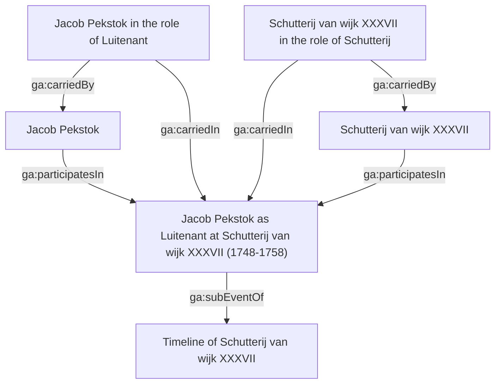

# Amsterdam Corporate Group Portraits (dataset)

- [Amsterdam Corporate Group Portraits (dataset)](#amsterdam-corporate-group-portraits-dataset)
  - [Introduction](#introduction)
  - [Data](#data)
    - [Changes](#changes)
  - [Model](#model)
    - [Dates](#dates)
    - [Linksets](#linksets)
    - [Provenance](#provenance)
  - [License / Citation](#license--citation)
  - [Contact](#contact)

## Introduction
The Amsterdam Corporate Group Portraits dataset contains biographical information on persons depicted on institutional/corporate group portraits in the seventeenth and eighteenth century in Amsterdam. The dataset is part of the [Golden Agents](https://goldenagents.org) project.

The original data were collected by Norbert Middelkoop and published as attachment to his dissertation [_Schutters, gildebroeders, regenten en regentessen_](https://hdl.handle.net/11245.1/509fbcc0-8dc0-44ae-869d-2620f905092e) (2019). The Golden Agent project took his data and heavily structured these, so that they could be used in the project's infrastructure infrastructure. 

We kept the original structure of the dataset, so that we separate information on:
1. Corporate group portraits (visual works)
2. Poorters [=Burghers] (persons)
3. Regentessen [=Regents (F)] (persons)
4. Regenten [=Regents (M)] (persons)
5. Gildenleden [=Guild members] (persons)

For all the persons, if available, we modelled information on their name, the portrait they are depicted on, when they were a regent or churchmaster, when they were a member of the civic guards (schutterij), when they were a member of a guild, and when they were a member of the city council. Besides this, we added information on their birth and death date, and their marriages.

Through linksets (see the [linkset documentation](linksets/README.md)) we linked the persons to Wikidata and to among others the [Amsterdam City Archives](https://archief.amsterdam). These linksets also serve as a way to link the persons to other datasets in the Golden Agents project.

## Data

The original data were downloaded from https://pure.uva.nl/ws/files/42046294/Bijlagen_4a_d.zip

The Linked Data version is generated by running `main.py` and is serialized in 5 files:
1. [`corporatiestukken.trig`](trig/corporatiestukken.trig)
2. [`gildenleden.trig`](trig/gildenleden.trig)
3. [`poorters.trig`](trig/poorters.trig)
4. [`regenten.trig`](trig/regenten.trig)
5. [`regentessen.trig`](trig/regentessen.trig)


### Changes

The spreadsheets were altered for transformation to RDF. No changes were made in content, only in syntax. See the git history for all changes made. 

## Model

The data is modelled in a mix of ontologies:
1. The Golden Agents ontology (https://data.goldenagents.org/ontology/)
2. The bio vocabulary (http://purl.org/vocab/bio/0.1/)
3. The Simple Event Model (http://semanticweb.cs.vu.nl/2009/11/sem/)

This dataset points to primary/archival sources, but each record is a biography/reconstruction on its own. Therefore, we model the data in the Golden Agents ontology so that it can be included directly in the Golden Agents Research Infrastructure. 

The model is event-based, so that every person is linked to an event (e.g. birth, death, marriage, etc.) with the `ga:participatesIn` property. A `ga:Role` instance (with corresponding `ga:carriedBy` and `carriedIn` properties) is used to reify this relationship. These events are also used to indicate someone's membership in a guild, civic guard, or city council with a begin and end date. Both the person as well as the organization are actors in such an event and are participating in a particular role (e.g. 'Luitenant' or 'Schutterij'). 

An example in a diagram:




Example in RDF Turtle:

```turtle
<https://data.goldenagents.org/datasets/corporatiestukken/person/poorters/3479> a ga:Person ;
    rdfs:label "Jacob Pekstok" ;
    bio:birth <https://data.goldenagents.org/datasets/corporatiestukken/event/poorters/3479-birth> ;
    bio:death <https://data.goldenagents.org/datasets/corporatiestukken/event/poorters/3479-death> ;
    prov:wasDerivedFrom <https://data.goldenagents.org/datasets/corporatiestukken/annotation/poorters/3479> ;
    ga:gender ga:Male ;
    ga:participatesIn <https://data.goldenagents.org/datasets/corporatiestukken/event/poorters/3479-birth>,
        <https://data.goldenagents.org/datasets/corporatiestukken/event/poorters/3479-death>,
        <https://data.goldenagents.org/datasets/corporatiestukken/event/poorters/3479-event-1> ;
    pnv:hasName <https://data.goldenagents.org/datasets/personname/5404adca-b18d-56be-aafd-07770802e3c1> .

<https://data.goldenagents.org/datasets/corporatiestukken/event/poorters/3479-event-1> a ga:Event ;
    rdfs:label "Jacob Pekstok as Luitenant at Schutterij van wijk XXXVII (1748-1758)"@en,
        "Jacob Pekstok als Luitenant bij Schutterij van wijk XXXVII (1748-1758)"@nl ;
    sem:hasEarliestBeginTimeStamp "1748-01-01"^^xsd:date ;
    sem:hasEarliestEndTimeStamp "1758-01-01"^^xsd:date ;
    sem:hasLatestBeginTimeStamp "1748-12-31"^^xsd:date ;
    sem:hasLatestEndTimeStamp "1758-12-31"^^xsd:date ;
    ga:participationOf <https://data.goldenagents.org/datasets/corporatiestukken/organization/XXXVII>,
        <https://data.goldenagents.org/datasets/corporatiestukken/person/poorters/3479> ;
    ga:subEventOf <https://data.goldenagents.org/datasets/corporatiestukken/event/XXXVII-1> .

<https://data.goldenagents.org/datasets/corporatiestukken/organization/XXXVII> a ga:Organization ;
    rdfs:label "Schutterij van wijk XXXVII"@nl ;
    ga:participatesIn <https://data.goldenagents.org/datasets/corporatiestukken/event/XXXVII-1>, <https://data.goldenagents.org/datasets/corporatiestukken/event/poorters/3479-event-1>

<https://data.goldenagents.org/datasets/corporatiestukken/role/poorters/3479-org-1> a <https://data.goldenagents.org/datasets/corporatiestukken/roletype/Schutterij> ;
    rdfs:label "Schutterij van wijk XXXVII in the role of Schutterij"@en,
        "Schutterij van wijk XXXVII in de rol van Schutterij"@nl ;
    ga:carriedBy <https://data.goldenagents.org/datasets/corporatiestukken/organization/XXXVII> ;
    ga:carriedIn <https://data.goldenagents.org/datasets/corporatiestukken/event/poorters/3479-event-1> .

<https://data.goldenagents.org/datasets/corporatiestukken/role/poorters/3479-role-1> a <https://data.goldenagents.org/datasets/corporatiestukken/roletype/Luitenant> ;
    rdfs:label "Jacob Pekstok in the role of Luitenant"@en,
        "Jacob Pekstok in de rol van Luitenant"@nl ;
    ga:carriedBy <https://data.goldenagents.org/datasets/corporatiestukken/person/poorters/3479> ;
    ga:carriedIn <https://data.goldenagents.org/datasets/corporatiestukken/event/poorters/3479-event-1> .

<https://data.goldenagents.org/datasets/corporatiestukken/event/XXXVII-1> a ga:Event ;
    rdfs:label "Timeline of Schutterij van wijk XXXVII"@en,
        "Tijdlijn van Schutterij van wijk XXXVII"@nl ;
    ga:participationOf <https://data.goldenagents.org/datasets/corporatiestukken/organization/XXXVII> ;
    ga:subEvent <https://data.goldenagents.org/datasets/corporatiestukken/event/poorters/3479-event-1> .

```

### Dates
We tried to convert all uncertain dates to valid ISO-8601 date spans. In case there was a 'ca.' notation, we interpreted this as an uncertainty range of ±2 years. This helps us to (bulk) query the data in our datastore.

For example, a notation of `1505 ca.` is converted to a date span of `1503-01-01/1507-12-31` (earliest begin / latest end). Depending on the context of the date, this sometimes is written as `1503-01-01|1503-12-31/1507-01-01|1507-12-31` (earliest begin | latest begin / earliest end | latest end).

### Linksets
The original spreadsheets did not contain unique person mentions. It could be that a person appeared in other files as well, or multiple times in the same file. We therefore created linksets that disambiguate persons within the dataset. See the [`linksets`](linksets/) folder for more information.

### Provenance
Only the CreativeWork and Person resources carry a `prov:wasDerivedFrom` property that refers to the row number of the original csv file. Original values were kept in different columns. Every file is converted to a separate named graph, so that the origin of certain statements can be traced once the data is loaded into a triplestore.

## License / Citation

If you use the data, alway cite the original research:

* Middelkoop, N. E. (2019). Schutters, gildebroeders, regenten en regentessen: Het Amsterdamse corporatiestuk 1525-1850. <https://hdl.handle.net/11245.1/509fbcc0-8dc0-44ae-869d-2620f905092e> 

This Linked Open Data version can be used under a CC-BY-SA 4.0 license.

* van Wissen, L., Reinders, J., & Middelkoop, N. (2022). Amsterdam Corporate Group Portraits (Version v1.0) [Data set]. https://github.com/knaw-huc/golden-agents-amsterdam-corporate-group-portraits/
## Contact

Golden Agents project

l.vanwissen@uva.nl